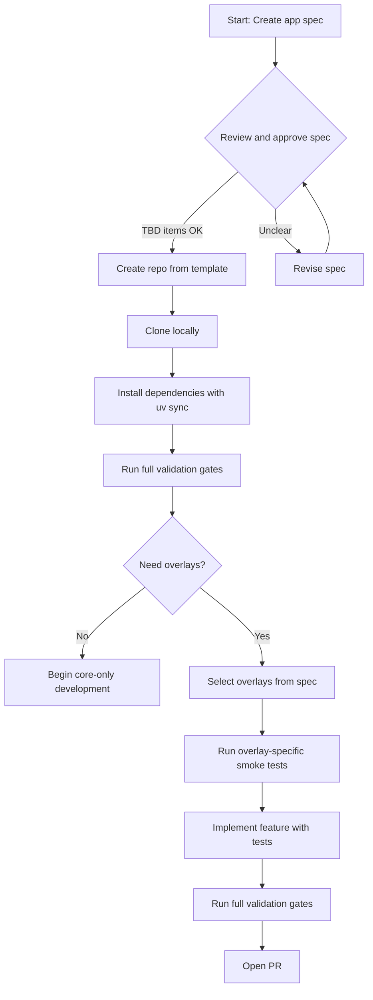
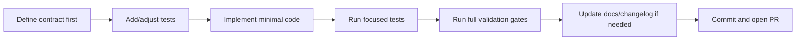
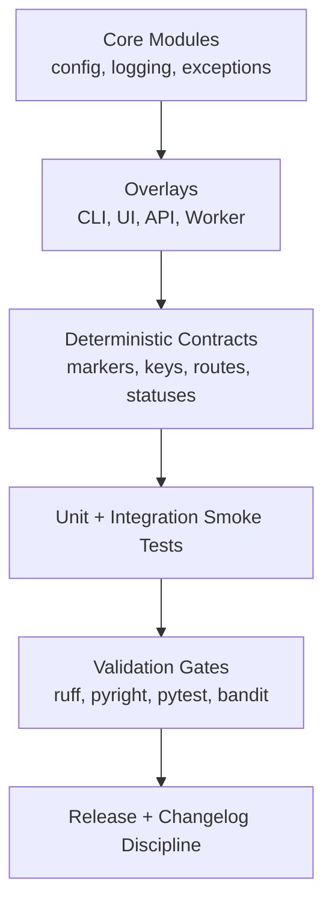

# Bootstrap and Generation Playbook

## Required Project Instructions Files

Every new project **must** include a `.copilot-instructions.md` file at the project root. This file sets guardrails and workflow expectations for Copilot agents and contributors. Copy and adapt the template from py-app-foundation, updating project-specific paths as needed.

You must also follow the [agent and skill file placement guide](../../luminara-app/docs/guide/agent-skill-file-placement.md) to ensure `.github/skills/` and `.github/instructions/` are set up for agent discovery.

This guide is intentionally explicit. It is designed for copy-paste execution with minimal interpretation.

## Outcome

By the end of this guide, you will have:

1. A new repository created from the foundation template.
2. A validated local environment with all gates passing.
3. A clear overlay selection (CLI, UI, API, Worker).
4. A repeatable process for generating your next feature safely.

## Big Picture



## Project Shape Decision Map

Use this table before writing code.

| If your project needs...      | Start with...                | Overlay validation commands                                                                 |
| ---------------------------- | ---------------------------- | ------------------------------------------------------------------------------------------ |
| Command-line workflows       | Core + CLI                   | `uv run starter health` and `uv run pytest tests/unit/test_cli.py tests/integration/test_cli_smoke.py -v` |
| Browser UI prototype         | Core + UI (Shared Base + Web)| `uv run pytest tests/unit/test_ui.py tests/integration/test_ui_smoke.py -v`                |
| Desktop shell app            | Core + UI Desktop            | `uv run pytest tests/unit/test_ui_desktop.py tests/integration/test_ui_desktop_smoke.py -v`|
| Mobile shell app             | Core + UI Mobile             | `uv run pytest tests/unit/test_ui_mobile.py tests/integration/test_ui_mobile_smoke.py -v`  |
| Service/API boundary         | Core + API                   | `uv run pytest tests/unit/test_api.py tests/integration/test_api_smoke.py -v`              |
| Background processing        | Core + Worker                | `uv run pytest tests/unit/test_worker.py tests/integration/test_worker_smoke.py -v`        |

## Step 0: Create and Review Application Specification

Before creating the repository, **document your project's requirements and constraints in an application specification**. This ensures overlay selection is driven by actual needs, not guesswork, and creates a durable record of architectural decisions.

### Why Specification First?

- Prevents mid-project overlay regrets
- Guides architecture, feature scope, and tech stack choices
- Creates a record of decisions for future maintainers and team members
- Helps AI agents and code reviewers understand intent without verbal context
- Reduces rework when scope shifts are caught early

### Get the Template

The template is at `docs/plan/app-spec.md` in py-app-foundation:

```bash
cp path/to/py-app-foundation/docs/plan/app-spec.md ./app-spec-YOUR_PROJECT_NAME.md
```

Or reference the completed example: `py-app-foundation/docs/plan/app-spec-luminara.md` demonstrates a filled spec for an art museum display application (Luminara).

### Fill Out These Sections (Minimum Viable Spec)

Complete these sections before moving to Step 1:

1. **Product Goal** — one-sentence description, primary users, top 3 user actions for v1
2. **App Shape** — which overlays (CLI, API, UI, Worker) and why
3. **Data and State** — persistence strategy (yes/no), storage choice, core entities
4. **Integrations** — external APIs, auth, special runtime needs (TTS, webhooks, etc.)
5. **Runtime and Deployment** — where it runs, OS constraints, environment strategy (dev-only vs prod)
6. **v1 Must-Have Features** — 3-5 non-negotiable features that define success
7. **Open Questions** — decisions still TBD (technology choices, hardware target, etc.)

### TBD Is Acceptable

Yes—use "TBD" for unknowns and revisit before implementation. The goal is to trap high-level assumptions early, not eliminate all uncertainty. For example:

- "Which museum APIs?" → OK to leave as TBD if you have time to research later
- "TTS engine choice?" → OK to defer if you have a reasonable default fallback

But high-level shape choices (REST+WebSocket vs GraphQL, single process vs services) should be reasoned through.

### Store It Somewhere Durable

Once completed, store your spec in version control:

```
luminara-app/
├── docs/
│   └── plan/
│       └── app-spec-luminara.md  ← your completed requirements
├── src/
└── ...
```

### Approval and Go/No-Go

Review the spec with anyone who will work on the project (team, stakeholders, yourself). Once stable, move to Step 1.

If reviewing or sketching for an AI agent, include the spec in your prompts—it acts as the contract for reliability and prevents scope creep.

## Step 1: Prerequisites

Run these checks from your terminal.

### Windows PowerShell

```powershell
python --version
uv --version
git --version
```

### macOS/Linux

```bash
python --version
uv --version
git --version
```

Expected baseline:

1. Python 3.14+
2. `uv` available on PATH
3. Git available on PATH

## Step 2: Create a New Repository From Template

### Option A: GitHub Template (recommended)

1. Open `https://github.com/marcgris/py-app-foundation`.
2. Click `Use this template`.
3. Create your new repository.
4. Clone it locally.

```bash
git clone https://github.com/YOUR_USERNAME/YOUR_PROJECT_NAME.git
cd YOUR_PROJECT_NAME
```

### Option B: Local Copy

```bash
cp -r path/to/py-app-foundation YOUR_PROJECT_NAME
cd YOUR_PROJECT_NAME
rm -rf .git
git init -b main
```

## Step 3: Install and Validate Baseline

Run this exact sequence from repository root.

```bash
uv sync
uv run ruff check .
uv run ruff format . --check
uv run pyright src/ tests/
uv run pytest tests/ -v
uv run bandit -r src/
```

If formatting check fails:

```bash
uv run ruff format .
uv run ruff format . --check
```

## Step 4: Choose and Verify Overlays

Pick only what you need now. You can add others later.

### CLI

```bash
uv run starter health
uv run starter config show
uv run starter --version
uv run pytest tests/unit/test_cli.py tests/integration/test_cli_smoke.py -v
```

### UI Web (Shared Base + Web)

```bash
uv run python -m http.server 4173 --directory src/starter/ui
# Then open: http://localhost:4173/web/
uv run pytest tests/unit/test_ui.py tests/integration/test_ui_smoke.py -v
```

### UI Desktop

```bash
uv run python src/starter/ui/desktop/app.py
uv run pytest tests/unit/test_ui_desktop.py tests/integration/test_ui_desktop_smoke.py -v
```

### UI Mobile

```bash
uv run python src/starter/ui/mobile/app.py
uv run pytest tests/unit/test_ui_mobile.py tests/integration/test_ui_mobile_smoke.py -v
```

### API

```bash
uv run python src/starter/api/app.py
uv run pytest tests/unit/test_api.py tests/integration/test_api_smoke.py -v
```

### Worker

```bash
uv run python src/starter/worker/app.py
uv run pytest tests/unit/test_worker.py tests/integration/test_worker_smoke.py -v
```

## Step 5: Generation Workflow For New Features

Use this flow for each new feature to keep architecture clean.



### 5.1 Define Contract First

Write down:

1. Input contract (what goes in).
2. Output contract (what comes out).
3. Failure contract (what should happen on invalid input/runtime failure).

### 5.2 Add Tests Before or With Implementation

At minimum, include:

1. One happy-path test.
2. One deterministic failure-path test.
3. One smoke-level contract test for external behavior.

### 5.3 Implement Smallest Safe Change

Use these design rules:

1. Keep core logic framework-light.
2. Keep overlays thin and contract-oriented.
3. Prefer deterministic outputs (stable keys, strings, and exit behavior).

### 5.4 Run Validation Gates Before Commit

```bash
uv run ruff check .
uv run ruff format . --check
uv run pyright src/ tests/
uv run pytest tests/ -v
uv run bandit -r src/
```

## Step 6: First Commit and Push

```bash
git add .
git commit -m "feat: bootstrap project from py-app-foundation"
git push -u origin main
```

## Architecture Mental Model

Keep this model in mind as complexity grows.



## Definition of Done For Bootstrap

You are done when all are true:

1. Baseline validation commands pass.
2. Chosen overlay smoke tests pass.
3. You can run the relevant entrypoints locally.
4. A new contributor can repeat your steps from docs without guessing.

## Related Guides

1. [new-project.md](new-project.md)
2. [contributing.md](contributing.md)
3. [release-checklist.md](release-checklist.md)
4. [../plan/ROADMAP.md](../plan/ROADMAP.md)
