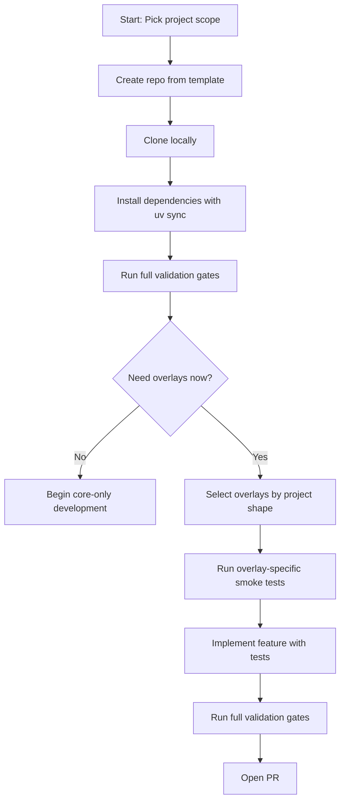
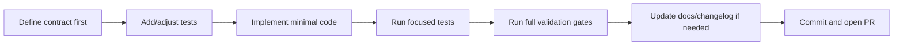
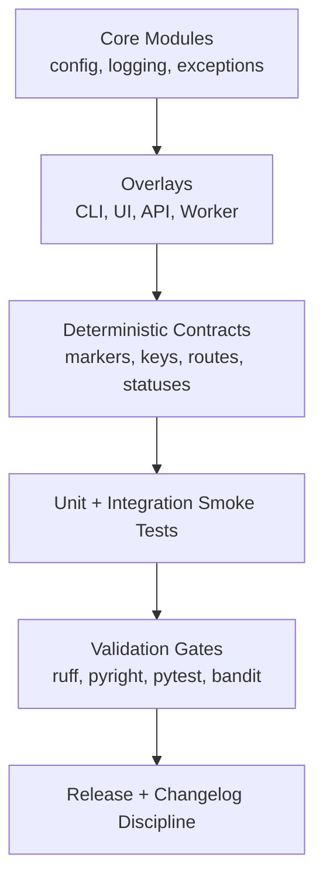

# Bootstrap and Generation Playbook

This guide is intentionally explicit. It is designed for copy-paste execution with minimal interpretation.

## Outcome

By the end of this guide, you will have:

1. A new repository created from the foundation template.
2. A validated local environment with all gates passing.
3. A clear overlay selection (CLI, UI, API, Worker).
4. A repeatable process for generating your next feature safely.

## Big Picture



## Project Shape Decision Map

Use this table before writing code.

| If your project needs... | Start with... | Overlay validation commands |
|---|---|---|
| Command-line workflows | Core + CLI | `uv run starter health` and `uv run pytest tests/unit/test_cli.py tests/integration/test_cli_smoke.py -v` |
| Browser UI prototype | Core + UI (Shared Base + Web) | `uv run pytest tests/unit/test_ui.py tests/integration/test_ui_smoke.py -v` |
| Desktop shell app | Core + UI Desktop | `uv run pytest tests/unit/test_ui_desktop.py tests/integration/test_ui_desktop_smoke.py -v` |
| Mobile shell app | Core + UI Mobile | `uv run pytest tests/unit/test_ui_mobile.py tests/integration/test_ui_mobile_smoke.py -v` |
| Service/API boundary | Core + API | `uv run pytest tests/unit/test_api.py tests/integration/test_api_smoke.py -v` |
| Background processing | Core + Worker | `uv run pytest tests/unit/test_worker.py tests/integration/test_worker_smoke.py -v` |

## Step 1: Prerequisites

Run these checks from your terminal.

### Windows PowerShell

```powershell
python --version
uv --version
git --version
```

### macOS/Linux

```bash
python --version
uv --version
git --version
```

Expected baseline:

1. Python 3.14+
2. `uv` available on PATH
3. Git available on PATH

## Step 2: Create a New Repository From Template

### Option A: GitHub Template (recommended)

1. Open `https://github.com/marcgris/py-app-foundation`.
2. Click `Use this template`.
3. Create your new repository.
4. Clone it locally.

```bash
git clone https://github.com/YOUR_USERNAME/YOUR_PROJECT_NAME.git
cd YOUR_PROJECT_NAME
```

### Option B: Local Copy

```bash
cp -r path/to/py-app-foundation YOUR_PROJECT_NAME
cd YOUR_PROJECT_NAME
rm -rf .git
git init -b main
```

## Step 3: Install and Validate Baseline

Run this exact sequence from repository root.

```bash
uv sync
uv run ruff check .
uv run ruff format . --check
uv run pyright src/ tests/
uv run pytest tests/ -v
uv run bandit -r src/
```

If formatting check fails:

```bash
uv run ruff format .
uv run ruff format . --check
```

## Step 4: Choose and Verify Overlays

Pick only what you need now. You can add others later.

### CLI

```bash
uv run starter health
uv run starter config show
uv run starter --version
uv run pytest tests/unit/test_cli.py tests/integration/test_cli_smoke.py -v
```

### UI Web (Shared Base + Web)

```bash
uv run python -m http.server 4173 --directory src/starter/ui
# Then open: http://localhost:4173/web/
uv run pytest tests/unit/test_ui.py tests/integration/test_ui_smoke.py -v
```

### UI Desktop

```bash
uv run python src/starter/ui/desktop/app.py
uv run pytest tests/unit/test_ui_desktop.py tests/integration/test_ui_desktop_smoke.py -v
```

### UI Mobile

```bash
uv run python src/starter/ui/mobile/app.py
uv run pytest tests/unit/test_ui_mobile.py tests/integration/test_ui_mobile_smoke.py -v
```

### API

```bash
uv run python src/starter/api/app.py
uv run pytest tests/unit/test_api.py tests/integration/test_api_smoke.py -v
```

### Worker

```bash
uv run python src/starter/worker/app.py
uv run pytest tests/unit/test_worker.py tests/integration/test_worker_smoke.py -v
```

## Step 5: Generation Workflow For New Features

Use this flow for each new feature to keep architecture clean.



### 5.1 Define Contract First

Write down:

1. Input contract (what goes in).
2. Output contract (what comes out).
3. Failure contract (what should happen on invalid input/runtime failure).

### 5.2 Add Tests Before or With Implementation

At minimum, include:

1. One happy-path test.
2. One deterministic failure-path test.
3. One smoke-level contract test for external behavior.

### 5.3 Implement Smallest Safe Change

Use these design rules:

1. Keep core logic framework-light.
2. Keep overlays thin and contract-oriented.
3. Prefer deterministic outputs (stable keys, strings, and exit behavior).

### 5.4 Run Validation Gates Before Commit

```bash
uv run ruff check .
uv run ruff format . --check
uv run pyright src/ tests/
uv run pytest tests/ -v
uv run bandit -r src/
```

## Step 6: First Commit and Push

```bash
git add .
git commit -m "feat: bootstrap project from py-app-foundation"
git push -u origin main
```

## Architecture Mental Model

Keep this model in mind as complexity grows.



## Definition of Done For Bootstrap

You are done when all are true:

1. Baseline validation commands pass.
2. Chosen overlay smoke tests pass.
3. You can run the relevant entrypoints locally.
4. A new contributor can repeat your steps from docs without guessing.

## Related Guides

1. [new-project.md](new-project.md)
2. [contributing.md](contributing.md)
3. [release-checklist.md](release-checklist.md)
4. [../plan/ROADMAP.md](../plan/ROADMAP.md)
